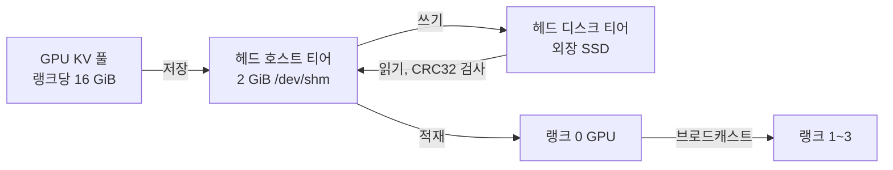

# vllm-ds4f-gb10: DGX Spark 4대에서 DeepSeek-V4.1-Flash

> vLLM 0.27.1 기반 DeepSeek V4 Flash(4.0) 라인은 [`gb10-longctx-offload`](https://github.com/nacyot/vllm-ds4f-gb10/tree/gb10-longctx-offload) 브랜치에 있습니다.

DGX Spark GB10 4대(TP=4)에서 **DeepSeek-V4.1-Flash**를 서빙하는 vLLM 포크입니다. 핵심 목표는 긴 에이전트 세션의 **KV 캐시를 디스크로 오프로딩**해 살려 두는 것입니다. GPU에서 밀려났거나 서버 재시작으로 사라진 세션은 프리필을 다시 하지 않고 디스크에서 복원합니다.

- **브랜치.** `dsv41-gb10`이 이 V4.1 라인이자 기본 브랜치입니다. [`gb10-longctx-offload`](https://github.com/nacyot/vllm-ds4f-gb10/tree/gb10-longctx-offload)는 따로 유지하는 이전 4.0 라인입니다.
- **기반.** upstream vLLM main `29af8bd672`(2026-09-04, 0.28.1 개발판)에 upstream의 DeepSeek-V4.1-Flash 지원과 이 브랜치의 커밋을 더했습니다.
- **범위.** 특정 클러스터용 참고 구현이며 운영 보증은 없습니다. 라이선스는 vLLM을 따라 Apache-2.0입니다. 작성자: nacyot.

(English: [README.md](README.md))

## 왜 디스크 오프로딩인가

이 클러스터에서 493K 토큰 세션을 처음부터 프리필하면 **392초**가 걸립니다. 같은 세션의 KV를 SSD에서 복원하면 첫 토큰까지 **7.8초**입니다. GPU 메모리에는 이런 세션이 몇 개만 들어가므로, 디스크 티어가 없으면 밀려나거나 재시작될 때마다 다음 턴이 몇 분짜리 대기가 됩니다.

## 동작 방식



- **GPU 풀.** 랭크당 KV 16 GiB에 457만 토큰이 들어갑니다. 493K 세션 7개를 상주시켜 1.8~2.3초에 전환했습니다.
- **호스트 티어.** 헤드의 `/dev/shm` 2 GiB가 GPU와 디스크 사이에서 블록을 잠시 담습니다. 행 크기는 KV 캐시 그룹별로 나눕니다. 통합 메모리라서 이 RAM은 GPU 몫에서 빠집니다.
- **디스크 티어.** 블록은 헤드의 `KVFS_DIR` 아래 파일로 저장되며 토큰당 약 3.2 KB라 493K 세션이 약 2 GB입니다. 블록마다 CRC32를 xattr에 기록하고, 적재 작업 하나당 네이티브 호출 한 번으로 한꺼번에 검사합니다. 저장소 디렉터리는 모델 경로와 실행 설정 해시로 정해져 재시작 뒤에도 그대로 씁니다.
- **릴레이 복원.** 호스트 티어와 디스크 티어는 랭크 0에만 있습니다. MLA KV는 모든 TP 랭크에서 같으므로, 랭크 0 GPU에 올린 블록을 64 MiB 단위로 다른 랭크에 브로드캐스트합니다. 디스크는 헤드에만 있으면 됩니다.
- **실패 처리.** 파일이 없거나 체크섬이 틀린 블록은 요청을 실패시키지 않고 다시 계산합니다.
- **보존.** systemd 타이머가 7일 지난 파일을 지우고, 저장소가 3000 GiB를 넘으면 오래된 파일부터 지웁니다.
- **Engram 테이블.** V4.1의 Engram 테이블 203 GB는 체크포인트 파일에 둔 채 읽기 전용 mmap으로 씁니다. 스텝마다 필요한 행을 미리 올리고, 다음 프리필 청크는 백그라운드에서 미리 읽고, 3스텝 뒤 페이지를 놓습니다.

### 이 포크에서 추가한 것

| 영역 | 변경 |
| --- | --- |
| KV 오프로드 | 멀티노드 TP용 랭크 0 릴레이 복원, 그룹별 호스트 티어 행, CRC32 일괄 검사(`csrc/fs_io.cpp`), 승격을 기다리는 요청의 재조회 생략 |
| Engram | 읽기 전용 mmap 테이블, 스텝별 프리폴트, 백그라운드 프리페치, 페이지 해제 |
| GB10 (SM121) | 어텐션, sparse FlashInfer, 인덱서 경로의 페이지 크기 수정 |
| 스케줄러 | 환경변수로 켜는 프리필 상한, 기본은 꺼짐 |
| 배포 | `deploy/gb10-cluster/dsv41/`의 런처, 기본값, 프로브, 벤치마크 |

## 측정값

운영 설정, GPU 클럭 상한 2000 MHz.

| 항목 | 결과 | 날짜 |
| --- | --- | --- |
| 외장 SSD에서 493K 세션 복원 | 첫 토큰 7.8초, 정답 | 2026-09-13 |
| 493K 세션 콜드 프리필 | 392초 | 2026-09-12 |
| 493K 세션 2개 동시 복원 | 첫 토큰 10.5초, 11.3초 | 2026-09-12 |
| GPU에 493K 세션 7개 상주 | 전환 1.8~2.3초 | 2026-09-11 |
| 프리필, 8K와 32K 프롬프트 | 1,737 tok/s, 1,464 tok/s | 2026-09-13 |
| 디코드, 1스트림과 4스트림 | 38.6 tok/s, 합계 78.6 tok/s | 2026-09-13 |

## 설치와 실행

하드웨어: DGX Spark GB10 4대(각 통합 메모리 128 GB), 200G RoCE 연결. 헤드 노드에 디스크 티어용 3.6 TB 외장 SSD가 있습니다. 모든 노드에 476 GB 체크포인트가 있어야 합니다.

각 노드에서 설치합니다(aarch64, CUDA 13). 기반 커밋과 맞는 precompiled wheel 위에 네이티브 부분 두 개를 다시 빌드합니다.

```bash
git clone -b dsv41-gb10 https://github.com/nacyot/vllm-ds4f-gb10 ~/vllm-dsv41
cd ~/vllm-dsv41
uv venv ~/vllm-dsv41-venv --python 3.12
VLLM_USE_PRECOMPILED=1 \
VLLM_PRECOMPILED_WHEEL_LOCATION="https://wheels.vllm.ai/29af8bd672d5a780abd7399c0cc624078202e89d/vllm-0.28.1rc1.dev391%2Bg29af8bd67-cp38-abi3-manylinux_2_28_aarch64.whl" \
VIRTUAL_ENV=~/vllm-dsv41-venv uv pip install -e . --torch-backend=cu130

# V4.1용 SM121 커널과 CRC 일괄 검사 확장
source ~/vllm-dsv41-venv/bin/activate
python tools/generate_cmake_presets.py --force-overwrite   # nvcc와 Python 경로를 묻습니다
cmake --preset release -DTORCH_CUDA_ARCH_LIST=12.1a
cmake --build --preset release --target _C_stable_libtorch -j 3
cp cmake-build-release/_C_stable_libtorch.abi3.so vllm/
PYTHON=~/vllm-dsv41-venv/bin/python csrc/build_fs_io.sh
```

노드에 SSH로 접속할 수 있는 작업 PC에서 실행합니다. 호스트 이름, 주소, 경로는 이 클러스터 기준이니 `dsv41_ctl.sh`와 `dsv41.env`에서 바꿉니다.

```bash
bash deploy/gb10-cluster/dsv41/dsv41_ctl.sh start    # 워커 먼저, 헤드는 마지막
bash deploy/gb10-cluster/dsv41/dsv41_ctl.sh status   # 랭크, 클럭 상한, API 상태
```

OpenAI 호환 API는 헤드의 8888 포트에서 `deepseek-v4.1-flash` 이름으로 응답합니다.

### 주요 설정

기본값은 `deploy/gb10-cluster/dsv41/dsv41.env`에 있고, 모두 환경변수로 덮어쓸 수 있습니다.

| 설정 | 기본값 | 의미 |
| --- | --- | --- |
| `MAXLEN` | 524288 | 컨텍스트 길이 |
| `KVMEM` | 16 GiB | 랭크당 GPU KV 풀 |
| `KVOFF_GIB` | 2 | 헤드 호스트 티어, 0이면 오프로딩 꺼짐 |
| `KVFS_DIR` | `/mnt/kvdisk/kv/dsv41` | 헤드 디스크 티어 위치, 비우면 디스크 티어 꺼짐 |
| `KV_RELAY` | true | 랭크 0에서 읽고 브로드캐스트해 복원 |
| `SEQS` | 16 | 동시 요청 수 |
| `SPEC`, `SPEC_K` | dspark, 5 | 체크포인트의 MTP 가중치를 쓰는 투기 디코딩 |
| `TEXT_ONLY`, `MM_IMAGES` | 0, 512 | 비전 켬, 프롬프트당 이미지 수 |
| `ENGRAM_MMAP`, `ENGRAM_PREFETCH` | 1, 1 | Engram 테이블 mmap과 프리페치 |

운영 안내 전체는 [deploy/gb10-cluster/dsv41/README.md](deploy/gb10-cluster/dsv41/README.md)에 있습니다.

## 한계

- **헤드 메모리.** 헤드 노드는 통합 메모리 여유가 적습니다. 256K 토큰 이상의 콜드 프리필은 `dsv41_ctl.sh headroom`이 5.2 GiB 이상일 때만 시작합니다. earlyoom은 2.43 GiB에서 동작합니다.
- **호스트 티어 크기.** 2 GiB에는 최대 길이 세션이 약 1.4개 들어가므로, 최대 길이 세션 여러 개를 한꺼번에 복원하면 중간 적재 공간이 빠듯합니다.
- **긴 콜드 프리필은 다른 요청을 막습니다.** 128K 콜드 프리필 뒤에서 짧은 요청이 약 87초 기다렸습니다.
- **저장소 식별.** 모델이나 KV 관련 실행 설정을 바꾸면 새 저장소 디렉터리가 생기고, 이전 항목은 보존 정책에 따라 지워집니다.
