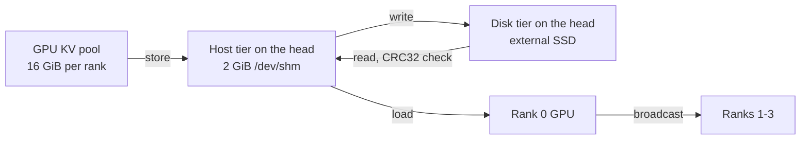

# vllm-ds4f-gb10: DeepSeek-V4.1-Flash on four DGX Spark

> Looking for the DeepSeek V4 Flash (4.0) line on vLLM 0.27.1? It lives on the [`gb10-longctx-offload`](https://github.com/nacyot/vllm-ds4f-gb10/tree/gb10-longctx-offload) branch.

A vLLM fork that serves **DeepSeek-V4.1-Flash** on four DGX Spark GB10 nodes (TP=4) and keeps long agent sessions alive by **offloading their KV cache to disk**. A session evicted from the GPU, or lost in a server restart, comes back from disk instead of being prefilled again.

- **Branches.** `dsv41-gb10` is this V4.1 line and the default branch. [`gb10-longctx-offload`](https://github.com/nacyot/vllm-ds4f-gb10/tree/gb10-longctx-offload) is the earlier 4.0 line, kept separately.
- **Base.** Upstream vLLM main at `29af8bd672` (2026-09-04, 0.28.1 dev) with upstream DeepSeek-V4.1-Flash support, plus the commits in this branch.
- **Scope.** A reference for one cluster, not a production guarantee. License Apache-2.0, inherited from vLLM. Author: nacyot.

(한국어: [README.ko.md](README.ko.md))

## Why disk offloading

On this cluster a 493K-token session costs **392 s** to prefill from scratch. Restoring the same session's KV from the SSD takes **7.8 s** to the first token. GPU memory holds only a handful of such sessions, so without a disk tier every eviction or restart turns the next turn into a multi-minute wait.

## How it works



- **GPU pool.** 16 GiB of KV per rank holds 4.57M tokens. Seven 493K sessions stayed resident and switched in 1.8 to 2.3 s.
- **Host tier.** 2 GiB of `/dev/shm` on the head stages blocks between GPU and disk. Rows are sized per KV cache group. Memory is unified, so this RAM comes out of the GPU's share.
- **Disk tier.** Blocks are files under `KVFS_DIR` on the head, about 3.2 KB per token, so a 493K session is about 2 GB. Each block carries a CRC32 in an xattr, verified in one batched native call per load job. The store directory is keyed by the model path and a hash of the run config, so a restart reuses it.
- **Relay restore.** Only rank 0 has the host and disk tiers. Loaded blocks are broadcast from rank 0's GPU to the other ranks in 64 MiB windows, since the MLA KV is the same on every TP rank. Only the head needs the disk.
- **Failure handling.** A block that is missing or fails its checksum is recomputed instead of failing the request.
- **Retention.** A systemd timer deletes store files older than 7 days, then the oldest files while the store exceeds 3000 GiB.
- **Engram tables.** V4.1's 203 GB of Engram tables stay in the checkpoint files and are memory-mapped read-only. Rows are prefaulted per step, the next prefill chunk is prefetched in the background, and pages are released after 3 steps.

### Added in this fork

| Area | Change |
| --- | --- |
| KV offload | Rank 0 relay restore for multi-node TP, per-group host tier rows, batched CRC32 check (`csrc/fs_io.cpp`), no re-scan of a request waiting on a promotion |
| Engram | Read-only mmap tables with per-step prefault, background prefetch and page release |
| GB10 (SM121) | Page-size fixes in attention, sparse FlashInfer and indexer paths |
| Scheduler | Env-gated prefill caps, off by default |
| Deploy | Launcher, defaults, probes and benchmarks in `deploy/gb10-cluster/dsv41/` |

## Measured

Production configuration, GPU clocks capped at 2000 MHz.

| Case | Result | Date |
| --- | --- | --- |
| 493K session restored from the external SSD | 7.8 s to first token, answer correct | 2026-09-13 |
| 493K session, cold prefill | 392 s | 2026-09-12 |
| Two 493K sessions restored at once | 10.5 s and 11.3 s to first token | 2026-09-12 |
| Seven 493K sessions resident on the GPU | 1.8 to 2.3 s per switch | 2026-09-11 |
| Prefill, 8K and 32K prompts | 1,737 and 1,464 tok/s | 2026-09-13 |
| Decode, 1 stream and 4 streams | 38.6 tok/s and 78.6 tok/s in total | 2026-09-13 |

## Setup

Hardware: four DGX Spark GB10 nodes (128 GB unified memory each) on a 200G RoCE link. The head node has a 3.6 TB external SSD for the disk tier. Every node needs the 476 GB checkpoint locally.

Install on each node (aarch64, CUDA 13). The precompiled wheel matches the base commit, and two native pieces are rebuilt on top of it:

```bash
git clone -b dsv41-gb10 https://github.com/nacyot/vllm-ds4f-gb10 ~/vllm-dsv41
cd ~/vllm-dsv41
uv venv ~/vllm-dsv41-venv --python 3.12
VLLM_USE_PRECOMPILED=1 \
VLLM_PRECOMPILED_WHEEL_LOCATION="https://wheels.vllm.ai/29af8bd672d5a780abd7399c0cc624078202e89d/vllm-0.28.1rc1.dev391%2Bg29af8bd67-cp38-abi3-manylinux_2_28_aarch64.whl" \
VIRTUAL_ENV=~/vllm-dsv41-venv uv pip install -e . --torch-backend=cu130

# SM121 kernels for V4.1 and the batched CRC extension
source ~/vllm-dsv41-venv/bin/activate
python tools/generate_cmake_presets.py --force-overwrite   # asks for the nvcc and Python paths
cmake --preset release -DTORCH_CUDA_ARCH_LIST=12.1a
cmake --build --preset release --target _C_stable_libtorch -j 3
cp cmake-build-release/_C_stable_libtorch.abi3.so vllm/
PYTHON=~/vllm-dsv41-venv/bin/python csrc/build_fs_io.sh
```

Start from a workstation with SSH access to the nodes. Host names, addresses and paths are this cluster's; change them in `dsv41_ctl.sh` and `dsv41.env`.

```bash
bash deploy/gb10-cluster/dsv41/dsv41_ctl.sh start    # workers first, then the head
bash deploy/gb10-cluster/dsv41/dsv41_ctl.sh status   # ranks, clock caps, API health
```

The OpenAI-compatible API listens on the head at port 8888 as `deepseek-v4.1-flash`.

### Main settings

Defaults live in `deploy/gb10-cluster/dsv41/dsv41.env`. Any of them can be overridden from the environment.

| Setting | Default | Meaning |
| --- | --- | --- |
| `MAXLEN` | 524288 | Context length |
| `KVMEM` | 16 GiB | GPU KV pool per rank |
| `KVOFF_GIB` | 2 | Host tier on the head; 0 turns offloading off |
| `KVFS_DIR` | `/mnt/kvdisk/kv/dsv41` | Disk tier root on the head; empty turns the disk tier off |
| `KV_RELAY` | true | Restore through rank 0 and broadcast |
| `SEQS` | 16 | Concurrent requests |
| `SPEC`, `SPEC_K` | dspark, 5 | Speculative decoding with the checkpoint's MTP weights |
| `TEXT_ONLY`, `MM_IMAGES` | 0, 512 | Vision on, images per prompt |
| `ENGRAM_MMAP`, `ENGRAM_PREFETCH` | 1, 1 | Engram tables from mmap, with prefetch |

The full operating guide is [deploy/gb10-cluster/dsv41/README.md](deploy/gb10-cluster/dsv41/README.md).

## Limits

- **Head memory.** The head node runs with little free unified memory. Start a cold prefill of 256K tokens or more only when `dsv41_ctl.sh headroom` reports at least 5.2 GiB. earlyoom acts at 2.43 GiB.
- **Host tier size.** 2 GiB holds about 1.4 max-length sessions, so several max-length restores at once have little staging room.
- **Long cold prefills block others.** A short request waited about 87 s behind a 128K cold prefill.
- **Store identity.** Changing the model or the KV-related run config starts a new store directory; old entries age out through retention.
